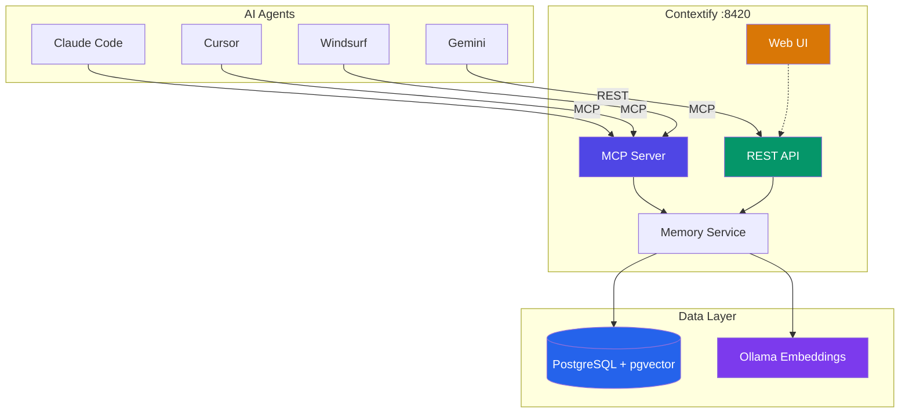

# Contextify

<p align="center">
  
</p>

<p align="center">
  <a href="https://github.com/atakanatali/contextify/actions/workflows/release.yml">
    
  </a>
  <a href="https://github.com/atakanatali/contextify/releases">
    
  </a>
  <a href="https://github.com/atakanatali/contextify/pkgs/container/contextify">
    
  </a>
  <a href="https://github.com/atakanatali/contextify/blob/main/LICENSE">
    
  </a>
</p>

Unified memory system for AI agents. Provides shared short-term and long-term memory across Claude Code, Cursor, Windsurf, Gemini, and any other AI tool.

## Core Architecture



> For detailed technical documentation, see [ARCHITECTURE.md](ARCHITECTURE.md).

## Quick Start

Install the CLI and set up everything in two commands:

```bash
curl -fsSL https://raw.githubusercontent.com/atakanatali/contextify/main/scripts/install-cli.sh | sh
contextify install
```

The install wizard will:
1. Pull and start the Docker container (PostgreSQL + Ollama + server + Web UI)
2. Ask which tools to configure: **Claude Code**, **Cursor**, **Windsurf**, **Gemini**
3. Set up MCP/REST integration, hooks, and prompt rules for each selected tool
4. Run a self-test to verify everything works

```
  Contextify Install
  ──────────────────
  ✓ Docker is available.
  ✓ Image pulled.
  ✓ Container started.
  ✓ Contextify is ready.

  Select AI tools to configure:

  ✓ 1) Claude Code
  ○ 2) Cursor
  ○ 3) Windsurf
  ✓ 4) Gemini

  Enter numbers separated by spaces (e.g., 1 2 3), or 'all':
```

### CLI Commands

```bash
# Management
contextify install                      # Full setup (pull, start, configure tools)
contextify start                        # Start the container
contextify stop                         # Stop the container
contextify restart                      # Restart the container
contextify update                       # Update to latest version
contextify update -v 0.4.0              # Update to specific version
contextify status                       # Show health, container, and tool status
contextify logs                         # Show container logs
contextify logs -f                      # Follow container logs
contextify uninstall                    # Remove tool configurations
contextify uninstall --remove-container # Also remove the Docker container
contextify version                      # Show CLI version

# Memory operations
contextify store "Bug fix" -t fix -T redis,backend -i 0.8 -c "Fixed timeout issue"
contextify recall "how to fix postgres connection"
contextify search --type solution --tags docker
contextify get <memory-id>
contextify delete <memory-id>
contextify promote <memory-id>
contextify stats
contextify context                      # Load project memories (auto-detects git repo)

# Pipe support
cat error.log | contextify store "Error log" --type error
```

### Non-interactive install

```bash
contextify install --tools claude-code,cursor    # Specific tools
contextify install --all                         # All detected tools
contextify install --all --no-test               # Skip self-test
```

### Manual Docker setup

If you prefer to start the container yourself without the CLI:

```bash
docker run -d --name contextify -p 8420:8420 \
  -v contextify-data:/var/lib/postgresql/data \
  ghcr.io/atakanatali/contextify:latest
```

Services:
- **Web UI**: http://localhost:8420
- **API**: http://localhost:8420/api/v1/
- **MCP**: http://localhost:8420/mcp
- **Health**: http://localhost:8420/health

## Manual Agent Setup

If you prefer manual configuration:

### Claude Code

Add to `~/.claude/settings.json`:

```json
{
  "mcpServers": {
    "contextify": {
      "type": "streamableHttp",
      "url": "http://localhost:8420/mcp"
    }
  }
}
```

### Cursor

Add to `~/.cursor/mcp.json`:

```json
{
  "mcpServers": {
    "contextify": {
      "url": "http://localhost:8420/mcp",
      "transport": "streamable-http"
    }
  }
}
```

### Windsurf

Add to `~/.codeium/windsurf/mcp_config.json`:

```json
{
  "mcpServers": {
    "contextify": {
      "serverUrl": "http://localhost:8420/mcp"
    }
  }
}
```

### Gemini / Other

Use the REST API. See [`prompts/gemini.md`](prompts/gemini.md) for the full prompt template.

```
Memory API: http://localhost:8420/api/v1/
- Start each session: POST /api/v1/context/{project}
- Store insights: POST /api/v1/memories
- Search: POST /api/v1/memories/search
- Recall (semantic): POST /api/v1/memories/recall
```

## MCP Tools

| Tool | Description |
|------|-------------|
| `store_memory` | Store a new memory (auto-embeds) |
| `recall_memories` | Semantic search with natural language |
| `search_memories` | Advanced search with filters |
| `get_memory` | Get memory by ID |
| `update_memory` | Update existing memory |
| `delete_memory` | Delete memory and relationships |
| `create_relationship` | Link two memories |
| `get_related_memories` | Find connected memories |
| `get_context` | Load all project memories (session start) |
| `promote_memory` | Promote short-term to permanent |

## REST API

```
POST   /api/v1/memories            Store memory
GET    /api/v1/memories/:id         Get memory
PUT    /api/v1/memories/:id         Update memory
DELETE /api/v1/memories/:id         Delete memory
POST   /api/v1/memories/search      Search
POST   /api/v1/memories/recall      Semantic recall
POST   /api/v1/memories/:id/promote Promote to long-term
GET    /api/v1/memories/:id/related Get related memories
POST   /api/v1/relationships        Create relationship
GET    /api/v1/stats                Stats
POST   /api/v1/context/:project     Get project context
```

## Memory Model

Each memory has:
- **type**: solution, problem, code_pattern, fix, error, workflow, decision, general
- **scope**: global (all projects) or project (scoped)
- **importance**: 0.0-1.0 (>= 0.8 = auto-permanent)
- **TTL**: automatic expiry with access-based extension
- **tags**: array for filtering
- **embedding**: auto-generated via Ollama (nomic-embed-text, 768d)

## TTL + Importance System

- New memories get default TTL of 24h
- Each access extends TTL by 50%
- Importance >= 0.8 -> automatic permanent storage
- Access count >= 5 -> auto-promoted to permanent
- Background job cleans expired memories every 5 minutes

## Tech Stack

- **Server**: Go + official MCP Go SDK
- **CLI**: Go + Cobra (single binary, cross-platform)
- **Database**: PostgreSQL 16 + pgvector (HNSW index)
- **Embeddings**: Ollama + nomic-embed-text (local, free)
- **Web UI**: React + Vite + Tailwind CSS
- **Transport**: Streamable HTTP (MCP) + REST API

## License

MIT
