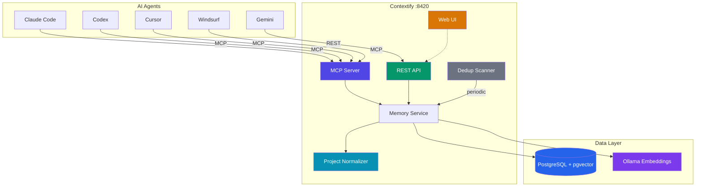

# Contextify

<p align="center">
  
</p>

<p align="center">
  <a href="https://github.com/atakanatali/contextify/actions/workflows/release.yml">
    
  </a>
  <a href="https://github.com/atakanatali/contextify/releases">
    
  </a>
  <a href="https://github.com/atakanatali/contextify/pkgs/container/contextify">
    
  </a>
  <a href="https://github.com/atakanatali/contextify/blob/main/LICENSE">
    
  </a>
</p>

Unified memory system for AI agents. Provides shared short-term and long-term memory across Claude Code, Codex, Cursor, Windsurf, Gemini, and any other AI tool.

**Key features:**
- **Smart Store** — automatic deduplication with similarity-based merge (>= 0.92 auto-merge, 0.75-0.92 suggest)
- **Project ID Normalization** — VCS-agnostic canonical names (worktrees, different machines, renames all resolve to the same identity)
- **Semantic + Keyword Search** — hybrid search with pgvector HNSW + full-text (70/30 weighting)
- **Memory Consolidation** — merge strategies (latest_wins, append, smart_merge), background dedup scanner, Web UI review
- **Multi-Agent** — MCP for Claude Code/Codex/Cursor/Windsurf, REST API for Gemini and others


## Core Architecture



> For detailed technical documentation, see [ARCHITECTURE.md](ARCHITECTURE.md).

## Quick Start

Install the CLI and set up everything in two commands:

```bash
curl -fsSL https://raw.githubusercontent.com/atakanatali/contextify/main/scripts/install-cli.sh | sh
contextify install
```

The install wizard will:
1. Pull and start the Docker container (PostgreSQL + Ollama + server + Web UI)
2. Ask which tools to configure: **Claude Code**, **Codex**, **Cursor**, **Windsurf**, **Gemini**
3. Set up MCP/REST integration, hooks, and prompt rules for each selected tool
4. Run a self-test to verify everything works

```
  Contextify Install
  ──────────────────
  ✓ Docker is available.
  ✓ Image pulled.
  ✓ Container started.
  ✓ Contextify is ready.

  Select AI tools to configure:

  ✓ 1) Claude Code
  ○ 2) Codex
  ○ 3) Cursor
  ○ 4) Windsurf
  ✓ 5) Gemini

  Enter numbers separated by spaces (e.g., 1 2 3), or 'all':
```

### CLI Commands

```bash
# Management
contextify install                      # Full setup (pull, start, configure tools)
contextify start                        # Start the container
contextify stop                         # Stop the container
contextify restart                      # Restart the container
contextify update                       # Update server + CLI (with confirmation)
contextify update -y                    # Update without confirmation prompt
contextify update -v 0.6.0              # Update to specific version
contextify update --skip-cli            # Update server only, keep current CLI
contextify status                       # Show health, container, and tool status
contextify logs                         # Show container logs
contextify logs -f                      # Follow container logs
contextify uninstall                    # Remove tool configurations
contextify uninstall --remove-container # Also remove the Docker container
contextify version                      # Show CLI version

# Memory operations
contextify store "Bug fix" -t fix -T redis,backend -i 0.8 -c "Fixed timeout issue"
contextify recall "how to fix postgres connection"
contextify search --type solution --tags docker
contextify get <memory-id>
contextify delete <memory-id>
contextify promote <memory-id>
contextify stats
contextify context                      # Load project memories (auto-detects git repo)

# Pipe support
cat error.log | contextify store "Error log" --type error
```

### Non-interactive install

```bash
contextify install --tools claude-code,codex,cursor # Specific tools
contextify install --all                         # All detected tools
contextify install --all --no-test               # Skip self-test
```

### Manual Docker setup

If you prefer to start the container yourself without the CLI:

```bash
docker run -d --name contextify -p 8420:8420 \
  -v contextify-data:/var/lib/postgresql/data \
  ghcr.io/atakanatali/contextify:latest
```

Services:
- **Web UI**: http://localhost:8420
- **API**: http://localhost:8420/api/v1/
- **MCP**: http://localhost:8420/mcp
- **Health**: http://localhost:8420/health

## Benchmark & SLO

Run the recall benchmark suite (requires a running server on `localhost:8420`):

```bash
make bench-recall
```

The benchmark is an E2E test and is excluded from default `go test ./...` runs.
It records latency distribution (`p50`, `p95`), hit-rate, and funnel deltas (`recall_attempts`, `recall_hits`, `store_opportunities`, `store_actions`) for the benchmark project.

The benchmark uses these optional thresholds:

- `RECALL_BENCH_MAX_P95_MS` (default: `2500`)
- `RECALL_BENCH_MIN_HIT_RATE` (default: `0.80`)
- `RECALL_BENCH_REPORT_PATH` (default: `artifacts/recall-benchmark-report.json`)

Example:

```bash
RECALL_BENCH_MAX_P95_MS=1200 RECALL_BENCH_MIN_HIT_RATE=0.90 \
RECALL_BENCH_REPORT_PATH=artifacts/local-recall-report.json \
make bench-recall
```

In CI (`Backend CI` workflow), the benchmark report is uploaded as the `recall-benchmark-report` artifact.

## Steward Operations (Rollout & Runbook)

The Steward subsystem now includes:

- Steward Console UI (`/steward`) for run history, event traces, tokens, latency, and controls
- runtime safety guardrails (backpressure, breaker state, stale-job recovery visibility)
- log security controls (redaction markers, retention cleanup, optional admin token guard)
- verification matrix artifact generation (`make verify-steward`)

Recommended rollout order:

1. enable steward in `dry_run=true`
2. monitor `/api/v1/steward/status` + `/steward`
3. enable write mode for high-confidence auto-merge
4. enable derivation
5. enable self-learn conservatively

Steward docs:

- [ADR-001 Memory Steward](docs/steward/ADR-001-memory-steward.md)
- [Telemetry Contract](docs/steward/telemetry-contract.md)
- [Reliability Hardening](docs/steward/reliability-hardening.md)
- [Log Security](docs/steward/log-security.md)
- [Verification Matrix](docs/steward/verification-matrix.md)
- [Rollout + SLO + Runbook](docs/steward/rollout-runbook.md)

## Manual Agent Setup

If you prefer manual configuration:

### Claude Code

Add to `~/.claude/settings.json`:

```json
{
  "mcpServers": {
    "contextify": {
      "type": "streamableHttp",
      "url": "http://localhost:8420/mcp"
    }
  }
}
```

### Codex

Use Codex MCP commands:

```bash
codex mcp add contextify --url http://localhost:8420/mcp
codex mcp list
```

The installer also writes Codex instructions to:
- `~/.contextify/codex-instructions.md`

### Cursor

Add to `~/.cursor/mcp.json`:

```json
{
  "mcpServers": {
    "contextify": {
      "url": "http://localhost:8420/mcp",
      "transport": "streamable-http"
    }
  }
}
```

### Windsurf

Add to `~/.codeium/windsurf/mcp_config.json`:

```json
{
  "mcpServers": {
    "contextify": {
      "serverUrl": "http://localhost:8420/mcp"
    }
  }
}
```

### Gemini / Other

Use the REST API. See [`prompts/gemini.md`](prompts/gemini.md) for the full prompt template.

```
Memory API: http://localhost:8420/api/v1/
- Start each session: POST /api/v1/context/{project}
- Store insights: POST /api/v1/memories
- Search: POST /api/v1/memories/search
- Recall (semantic): POST /api/v1/memories/recall
```

## MCP Tools

| Tool | Description |
|------|-------------|
| `store_memory` | Store a new memory (auto-embeds, auto-dedup) |
| `recall_memories` | Semantic search with natural language |
| `search_memories` | Advanced search with filters |
| `get_memory` | Get memory by ID |
| `update_memory` | Update existing memory |
| `delete_memory` | Delete memory and relationships |
| `create_relationship` | Link two memories |
| `get_related_memories` | Find connected memories |
| `get_context` | Load all project memories (session start) |
| `promote_memory` | Promote short-term to permanent |
| `consolidate_memories` | Merge duplicate memories with strategy |
| `find_similar` | Find similar memories by content |
| `suggest_consolidations` | Get pending merge suggestions |

## REST API

```
POST   /api/v1/memories              Store memory (Smart Store with dedup)
GET    /api/v1/memories/:id           Get memory
PUT    /api/v1/memories/:id           Update memory
DELETE /api/v1/memories/:id           Delete memory
POST   /api/v1/memories/search        Search
POST   /api/v1/memories/recall        Semantic recall
POST   /api/v1/memories/:id/promote   Promote to long-term
POST   /api/v1/memories/:id/merge     Merge two memories
GET    /api/v1/memories/:id/related   Get related memories
GET    /api/v1/memories/duplicates    Find duplicate memories
POST   /api/v1/memories/consolidate   Batch consolidation
POST   /api/v1/relationships          Create relationship
GET    /api/v1/stats                  Stats
POST   /api/v1/context/:project       Get project context

GET    /api/v1/consolidation/suggestions      Pending merge suggestions
PUT    /api/v1/consolidation/suggestions/:id  Accept/reject suggestion
GET    /api/v1/consolidation/log              Consolidation audit log

GET    /api/v1/steward/status                 Steward runtime status/mode
GET    /api/v1/steward/runs                   Steward runs (filters + pagination)
GET    /api/v1/steward/jobs/:id/events        Steward job event timeline
GET    /api/v1/steward/metrics                Steward aggregate metrics (UI KPIs)
POST   /api/v1/steward/run-once               Trigger one steward tick
PUT    /api/v1/steward/mode                   Update paused/dry-run mode
POST   /api/v1/steward/jobs/:id/retry         Retry failed/dead-letter steward job
POST   /api/v1/steward/jobs/:id/cancel        Cancel queued/running steward job

POST   /api/v1/admin/normalize-projects       Trigger project ID normalization
```

## Memory Model

Each memory has:
- **type**: solution, problem, code_pattern, fix, error, workflow, decision, general
- **scope**: global (all projects) or project (scoped)
- **importance**: 0.0-1.0 (>= 0.8 = auto-permanent)
- **TTL**: automatic expiry with access-based extension
- **tags**: array for filtering
- **embedding**: auto-generated via Ollama (nomic-embed-text, 768d)
- **version**: increments on merge (consolidation tracking)
- **merged_from**: UUID array of source memories absorbed during merge

## Smart Store (Deduplication)

When storing a memory, the server automatically checks for similar existing content:

| Similarity | Action |
|-----------|--------|
| >= 0.92 | **Auto-merge** — content is merged into the existing memory |
| 0.75 - 0.92 | **Suggest** — creates a pending suggestion for human/agent review |
| < 0.75 | **Normal store** — stored as a new memory |

Merge strategies: `latest_wins` (replace), `append` (concatenate), `smart_merge` (intelligent blend, default).

## Project ID Normalization

Agents send their working directory as `project_id`. The server automatically normalizes it to a canonical name:

```
/Users/alice/repos/myapp/.claude/worktrees/feature-x
→ github.com/alice/myapp
```

Priority order:
1. `.contextify.yml` — explicit `name:` field (highest priority, VCS-independent)
2. VCS remote — parse `.git/config` or `.hg/hgrc` files (no git binary needed)
3. Worktree strip — remove `/.claude/worktrees/<name>` suffix
4. Raw path — unchanged fallback

This means worktrees, different clone locations, and renames all resolve to the same project identity.

## TTL + Importance System

- New memories get default TTL of 24h
- Each access extends TTL by 50%
- Importance >= 0.8 -> automatic permanent storage
- Access count >= 5 -> auto-promoted to permanent
- Background job cleans expired memories every 5 minutes

## Tech Stack

- **Server**: Go + official MCP Go SDK
- **CLI**: Go + Cobra (single binary, cross-platform)
- **Database**: PostgreSQL 16 + pgvector (HNSW index)
- **Embeddings**: Ollama + nomic-embed-text (local, free)
- **Web UI**: React + Vite + Tailwind CSS
- **Transport**: Streamable HTTP (MCP) + REST API

## License

MIT
