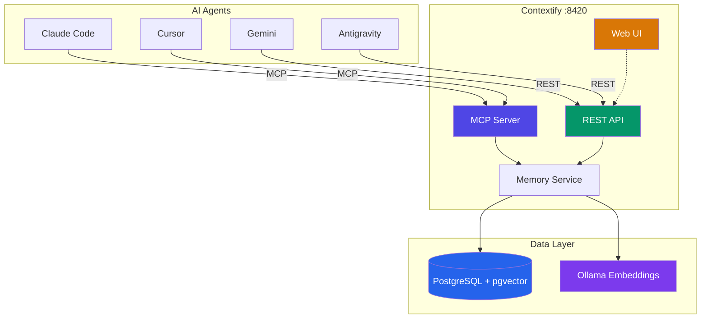

# Contextify

<p align="center">
  
</p>

<p align="center">
  <a href="https://github.com/atakanatali/contextify/actions/workflows/release.yml">
    
  </a>
  <a href="https://github.com/atakanatali/contextify/releases">
    
  </a>
  <a href="https://github.com/atakanatali/contextify/pkgs/container/contextify">
    
  </a>
  <a href="https://github.com/atakanatali/contextify/blob/main/LICENSE">
    
  </a>
</p>

Unified memory system for AI agents. Provides shared short-term and long-term memory across Claude Code, Cursor, Gemini, Antigravity, and any other AI tool.

## Core Architecture



> For detailed technical documentation, see [ARCHITECTURE.md](ARCHITECTURE.md).

## Quick Start

Everything included in a single Docker image — PostgreSQL, Ollama, embeddings model, server, and Web UI:

```bash
docker run -d --name contextify -p 8420:8420 \
  -v contextify-data:/var/lib/postgresql/data \
  ghcr.io/atakanatali/contextify:latest
```

Or with Docker Compose:

```bash
curl -fsSL https://github.com/atakanatali/contextify/releases/latest/download/docker-compose.prod.yml -o docker-compose.yml
docker compose up
```

For development (separate services, build from source):

```bash
git clone https://github.com/atakanatali/contextify.git
cd contextify
docker compose up
```

Services:
- **Web UI**: http://localhost:8420
- **API**: http://localhost:8420/api/v1/
- **MCP**: http://localhost:8420/mcp
- **Health**: http://localhost:8420/health

## Automatic Setup

The installer starts Contextify, detects your AI tools, and configures everything:

```bash
git clone https://github.com/atakanatali/contextify.git
cd contextify
./install.sh
```

What it does:
- Starts `contextify:latest` Docker container (if not running)
- Detects Claude Code, Cursor (auto)
- Adds MCP server config to each tool
- Installs Claude Code hooks (auto-context at session start)
- Installs system prompt rules for each tool
- Runs a self-test to verify everything works

To uninstall: `./install.sh --uninstall`

## Manual Agent Setup

If you prefer manual configuration:

### Claude Code

Add to `~/.claude/settings.json`:

```json
{
  "mcpServers": {
    "contextify": {
      "type": "streamableHttp",
      "url": "http://localhost:8420/mcp"
    }
  }
}
```

### Cursor

Add to `~/.cursor/mcp.json`:

```json
{
  "mcpServers": {
    "contextify": {
      "url": "http://localhost:8420/mcp",
      "transport": "streamable-http"
    }
  }
}
```

### Gemini / Other

Use the REST API. See [`prompts/gemini.md`](prompts/gemini.md) for the full prompt template.

```
Memory API: http://localhost:8420/api/v1/
- Start each session: POST /api/v1/context/{project}
- Store insights: POST /api/v1/memories
- Search: POST /api/v1/memories/search
- Recall (semantic): POST /api/v1/memories/recall
```

## MCP Tools

| Tool | Description |
|------|-------------|
| `store_memory` | Store a new memory (auto-embeds) |
| `recall_memories` | Semantic search with natural language |
| `search_memories` | Advanced search with filters |
| `get_memory` | Get memory by ID |
| `update_memory` | Update existing memory |
| `delete_memory` | Delete memory and relationships |
| `create_relationship` | Link two memories |
| `get_related_memories` | Find connected memories |
| `get_context` | Load all project memories (session start) |
| `promote_memory` | Promote short-term to permanent |

## REST API

```
POST   /api/v1/memories            Store memory
GET    /api/v1/memories/:id         Get memory
PUT    /api/v1/memories/:id         Update memory
DELETE /api/v1/memories/:id         Delete memory
POST   /api/v1/memories/search      Search
POST   /api/v1/memories/recall      Semantic recall
POST   /api/v1/memories/:id/promote Promote to long-term
GET    /api/v1/memories/:id/related Get related memories
POST   /api/v1/relationships        Create relationship
GET    /api/v1/stats                Stats
POST   /api/v1/context/:project     Get project context
```

## Memory Model

Each memory has:
- **type**: solution, problem, code_pattern, fix, error, workflow, decision, general
- **scope**: global (all projects) or project (scoped)
- **importance**: 0.0-1.0 (>= 0.8 = auto-permanent)
- **TTL**: automatic expiry with access-based extension
- **tags**: array for filtering
- **embedding**: auto-generated via Ollama (nomic-embed-text, 768d)

## TTL + Importance System

- New memories get default TTL of 24h
- Each access extends TTL by 50%
- Importance >= 0.8 -> automatic permanent storage
- Access count >= 5 -> auto-promoted to permanent
- Background job cleans expired memories every 5 minutes

## Tech Stack

- **Server**: Go + official MCP Go SDK
- **Database**: PostgreSQL 16 + pgvector (HNSW index)
- **Embeddings**: Ollama + nomic-embed-text (local, free)
- **Web UI**: React + Vite + Tailwind CSS
- **Transport**: Streamable HTTP (MCP) + REST API

## License

MIT
